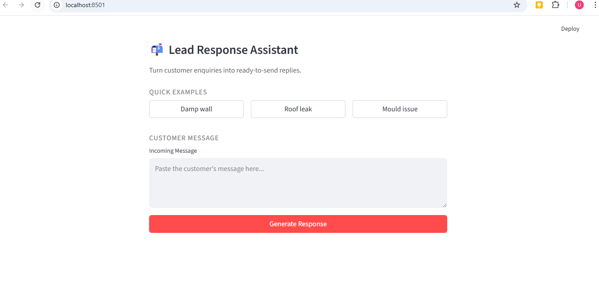
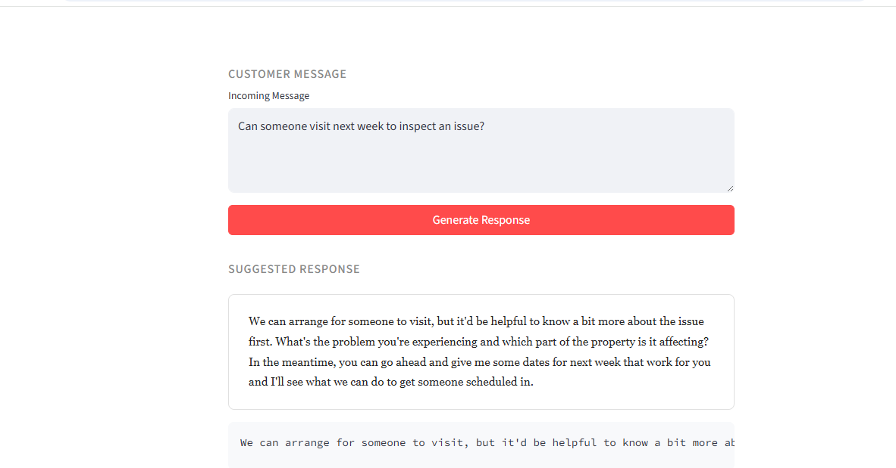

# Demonstration Walkthrough

## What Was Built

A Lead Response Assistant that converts raw customer enquiries into structured draft replies.
The goal is to assist communication while avoiding assumptions or speculative advice.

---

## How It Works

The system follows a constrained AI workflow:

1. Accepts free-text customer enquiry
2. Uses a guided prompt to interpret intent
3. Generates clarification-first responses instead of solutions
4. Suggests safe next steps without making commitments

This ensures responses remain reliable and aligned with real operational usage.

---

## Accuracy and Reliability Measures

- The assistant is prevented from diagnosing issues.
- It avoids guarantees, timelines, or technical claims.
- Responses are generated as drafts only, keeping a human reviewer in control.
- The workflow emphasises information gathering rather than conclusions.

---

## Known Limitations

- Cannot validate real-world conditions.
- Depends entirely on the information provided in the enquiry.
- Designed as a drafting aid, not a decision-making system.

---

## Future Improvements

With more time, this could include:

- Retrieval-Augmented Generation (RAG) using internal knowledge
- Intent classification for automated routing
- Logging and traceability of generated drafts
- Feedback-based refinement

---

## Screenshots

